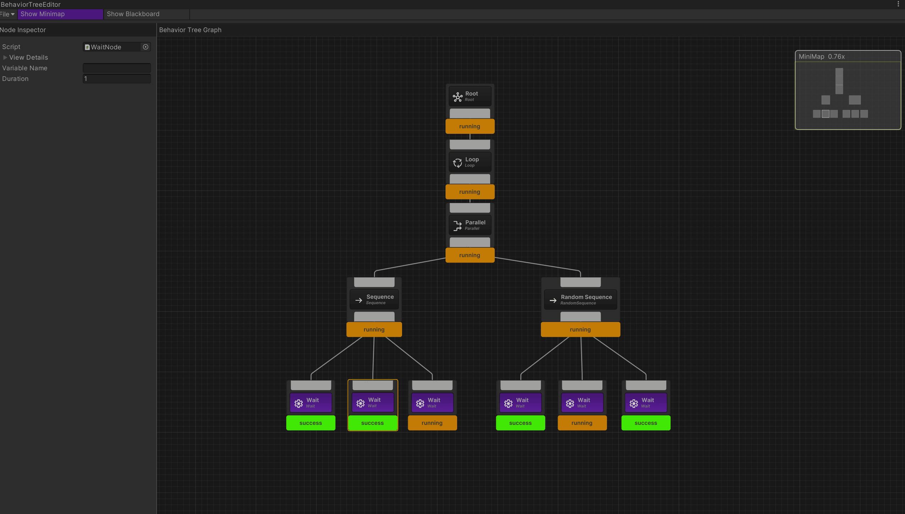
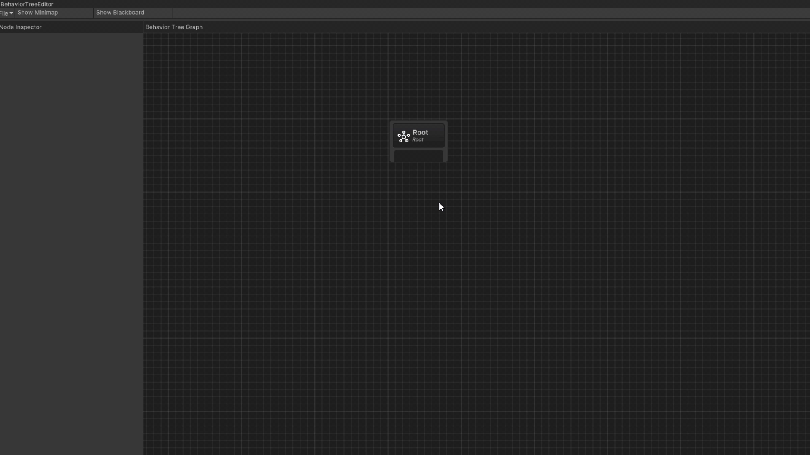
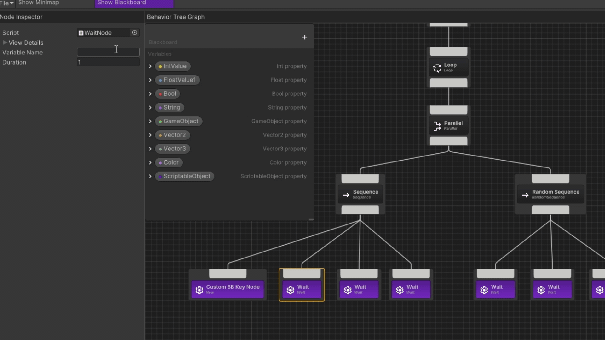

# Behavior Tree Framework for Unity

<p>
  
  
  
</p>

A Behavior Tree Framework designed for Unity 2023 and below, with support for Unity 6. This tool simplifies the implementation of complex AI behaviors with a range of features to enhance development.

---

## Features

### Core Framework
A framework for creating, managing, and running behavior trees. The package is compatible with Unity 2023 and below (The Unity 6 version is still a work in progress.)

### Node System
Includes more than 17 customizable nodes for defining AI behaviors, which can be extended through code.


### Script Generation
Allows users to create scripts directly from the graph editor, with all necessary methods pre-generated.

### Debugging
Displays runtime states of nodes for the selected behavior tree instance.



### Blackboard
Blackboard values can be accessed and modified through code and displayed in a dropdown menu in the Inspector to prevent typos when setting values.

### User Interface
An Unreal Engine-inspired interface for creating, calling, and managing nodes and behaviors.

### Variable System
Optional variable identifiers for nodes, similar to [WPF’s x:Name](https://learn.microsoft.com/en-us/dotnet/desktop/xaml-services/xname-directive), which enable external classes to access specific nodes by their variable names.

---

## Installation

1. Download the package.
2. Import the package into Unity by dragging the package file into the project files or check [this guide](https://docs.unity3d.com/6000.0/Documentation/Manual/AssetPackagesImport.html).
3. You're good to go!

---

## Quick Start

### Creating a new Behavior Tree
1. Start by creating a Behavior Tree asset by right-clicking in the `project tab` and choosing `Create > Behavior Tree`.
2. Double-click the created Behavior Tree asset, and the Custom Editor Window should pop up with the root node in the center.

### Modifying a Behavior Tree
1. Add any of the preexisting nodes by pressing the spacebar and searching for the node you want to create. Left-click on the node you want and it will be added to the graph. Alternatively, similar to how Shader Graph works, you can drag a connection out of an existing node, release it, and the same menu will appear, automatically connecting the newly created node.
2. You can modify the displayed name of the node, as well as the description tooltip via the `Node Inspector` on the left side of the graph window. Additionally, any serialized variables will be displayed in the Node Inspector as well. 
Here's a list of shortcuts that can be used in the graph view:

| Shortcut | Functionality|
|-|-|
| Ctrl + C | Copy selected node/s.|
| Ctrl + V | Paste selected node/s.|
| Ctrl + D | Duplicate selected node/s.|
| Ctrl + Z | Undo.|
| shift + h| Center selected nodes horizontally.|
| shift + v| Center selected nodes vertically.|
| shift + UpArrow| Up-align selected nodes.|
| shift + DownArrow| Down-align selected nodes.|
| shift + LeftArrow| Left-align selected nodes.|
| shift + RightArrow| Right-align selected nodes.|

**Note**: *Due to how Unity renders graphs, it is advisable not to use the undo command when the graph is large and complex, as it will have to iterate through every single node.*

### Connecting a Behavior Tree to a GameObject Agent
1. Add a BehaviorTreeRunner component to the GameObject that will act as an agent (the entity that the Behavior Tree will control).

| Variable | Functionality |
|-|-|
| Tree| A reference of the Behavior Tree that will be run by the agent.|
| RunOnStart| If enabled, the Behavior Tree will start running as soon as the game starts (called in Start()).|
| Agent| A reference to the agent. This should ideally, be a custom script to communicate with the Behavior Tree. It must inherit from MonoBehaviour. To quickly test the Behavior Tree without creating a custom agent controller, you can reference the BehaviorTreeRunner itself.|


2. To run the `BehaviorTreeRunner` manually, you can call the `Run(Agent)` method through code:


``` C#
public class SomeAgentClass : MonoBehaviour
{
    [SerializeField] private BehaviorTreeRunner _runner;

    private void Start()
    {
        _runner.Run(this);
        // OR
        _runner.Run(); // works only if an agent reference is provided in the inspector
    }
}
```

3. To stop the runner, simply call `Stop()` without passing any arguments.

### Adding new nodes
1. Press the space bar in the graph window.
2. From the context menu, select an option to create a new node based on the type you need. The package provides five unique node types users can choose from:


| Node Type                | Description |
|--------------------------|-------------|
| **Action**              | Executes a specific task, such as moving, attacking, or playing an animation. |
| **Composite**           | Controls the execution order of multiple child nodes. |
| **Decorator**           | Modifies the behavior of a single child node, such as adding conditions, inverting results, or applying cooldowns. |
| **Conditional Check**   | Evaluates a condition and returns success or failure without executing an action. This node is a type of decorator node. |
| **Conditional Loop**    | Repeats execution of a child node while a condition remains true. This node is a type of decorator node. |

3. Name the node script and choose a directory to save it.
4. Open it and modify the script as needed.

Example: Action Node script structure:
``` C#
[NodePath("New Nodes/YourNodeName")]
public class NewActionNode : ActionNode
{
	protected override void OnStart()
	{
		// start logic
	}

	protected override NodeState OnUpdate()
	{
		// update logic
		return NodeState.Success;
	}

	protected override void OnExit()
	{
		// exit logic
	}
}
```

Example: Conditional Check Node script structure:
``` C#
[NodePath("New Nodes/YourNodeName")]
public class NewConditionalCheckNode : ConditionalCheckNode
{
	protected override bool IsTrue()
	{
		// condition
		return true;
	}
}
```

#### Node Path Attribute
The custom attribute `[NodePath(string path)]` makes it easier to find the nodes through the context menu. If a node does not have this attribute, it will be placed under the default directory `New Nodes/NodeName`. Consider the following Node Path assigned for a new node called `NewNode`:
``` C#
[NodePath("Custom/Node/Path/New Node")]
public class NewNode : ActionNode
{
	protected override void OnStart()
	{
		// start logic
	}

	protected override NodeState OnUpdate()
	{
		return NodeState.Success;
	}

	protected override void OnExit()
	{
	}
}
```
This is what its path will look like in the context menu:



### Node essentials:
When working with the nodes in this framework, there are a couple of methods and terms that must understood to ensure nothing breaks down the line. Here are some key concepts:

#### Key members

|Member| Description|Can be overriden|
|-|-|-|
|`BlackboardVariableContainer Blackboard`| Returns the blackboard from which values can be retrieved using `BlackboardKey`s.|No|
|`NodeViewDetails ViewDetails`| An object that holds the node's name and description based on what was set in the `Node Inspector`.|Yes, through the `Node Inspector`|
|`string VariableName`| The unique variable name of the name if set in the `Node Inspector`.|Yes, through the `Node Inspector`|
|`void GetAgent<T>()`| Returns the agent controlling the Behavior Tree. T must be a MonoBehaviour.|No|
|`NodeState Update()`| Returns the node's current state which can be Running, Failure, or Success.|No|
|`void OnAwake()`| Called once during the Behavior Tree's initialization.| Yes|
|`void OnStart`| Called when a node starts executing.| Yes|
|`void OnUpdate()`| Called continuously while the node is running.| Yes|
|`void OnExit()`| Called when the node finishes execution.| Yes|
|`void Interrupt()`| Forcibly stops the node's execution and sets its state to `Interrupted`. Used when external conditions require the task to be aborted before completion.| No|

#### Node states
A node can have one of 3 states at a given time:
|State| Description|
|-|-|
|Running|The node is still performing the task.|
|Success|The node successfully completed the task.|
|Failure|The node failed to complete the task.| 
|Interrupted| The node was externally stopped before completing the task.|

#### Workflow
When a node is called by its parent node, `OnStart()`, `OnUpdate()`, and `OnExit()` are executed in order. `OnStart()` and `OnExit()` are called once, while `OnUpdate()` is called repeatedly for as long as it returns `NodeState.Running`. As soon as `OnUpdate()` returns `NodeState.Success` or `NodeState.Failure`, `OnExit()` is triggered, and the parent node receives the result from the child node.

#### Built-in nodes
| Node                    | Description |
|-|-|
| `ConditionalCheckNode`  | Evaluates a condition and returns `Success` or `Failure` without executing an action. |
| `CooldownNode`         | Prevents its child from running again until a cooldown period has elapsed. |
| `FailureNode`          | Always returns `Failure`, regardless of its child's result. |
| `ForceStateNode`       | Forces its child to return a specified `NodeState`, overriding its actual result. |
| `InvertNode`           | Inverts the result of its child, returning `Success` on `Failure` and vice versa. |
| `RepeatNode`           | Repeats execution of its child a specified number of times or indefinitely. |
| `SucceederNode`        | Always returns `Success`, regardless of its child's result. |
| `TimeoutNode`          | Interrupts its child if execution exceeds a specified time limit. |
| `ConditionalLoopNode`  | Repeats execution of its child while a condition remains true. |
| `LoopNode`            | Continuously executes its child indefinitely. |
| `ParallelNode`        | Runs multiple child nodes simultaneously and returns success or failure based on a defined policy. |
| `RandomSelectorNode`  | Selects and runs one of its children at random until one succeeds. |
| `RandomSequenceNode`  | Runs all its children in a random order, stopping on the first failure. |
| `SelectorNode`        | Executes children from left to right, returning `Success` if any child succeeds. |
| `SequenceNode`        | Executes children from left to right, returning `Failure` if any child fails. |
| `BehaviorTreeNode`    | The root node that manages execution flow within the behavior tree. |
| `PrintNode`          | Outputs a debug message to the console when executed. |
| `WaitNode`           | Delays execution for a specified amount of time before returning `Success`. |
| `RandomWaitNode` | Delays execution for a random amount of time within a provided range before returning `Success`.|

#### Blackboard keys
To access Blackboard variables within nodes, declare a BlackboardKey variable and assign it a value in the Node Inspector based on the defined Blackboard variables. Here's a snippent of how to use it:

##### Adding variables to the Blackboard

``` C#
public class NewNode : ActionNode
{
	public BlackboardKey CustomKey;

	protected override void OnStart()
	{
		// if the key is intended to reference to an integer value
		int intValue = Blackboard.GetValue<int>(CustomKey.Value);
		// Vector2 vector2Value = Blackboard.GetValue<Vector2>(CustomKey.Value);
		// GameObject gameObjectValue = Blackboard.GetValue<GameObject>(CustomKey.Value);
		// and so on
		
		Debug.Log($"Blackboard value: {CustomKey}");
	}

// rest of the script
```


Currently, the framework supports nine data types: `boolean`, `integer`, `float`, `string`, `Vector2`, `Vector3`, `Color`, `GameObject` (from the assets, not the scene), and `ScriptableObjects`. More data types are to be introduced in future interations. 

#### External Node Variable Identifiers
Nodes can be accessed from outside the Behavior Tree, providing a communication channel between the framework and the rest of the game. It works in a similar fashion to how UI elements can be accessed from code in WPF where an optional variable name is declared in the node and can then be accessed anywhere through the Behavior Tree Runner. Below is a clip demonstrating how to assign a variable name to a selected node, followed by a code snippet showing its usage:



``` C#
public class SomeAgentClass : MonoBehaviour
{
    private const string NODE_VARIABLE_NAME = "useTheExactVariableName";

    private void PrintNodeIntValue()
    {
	// Tree is reference to the BehaviorTree
	BaseNode node = _runner.Tree.GetNodeByVariable(NODE_VARIABLE_NAME);
    }
}
```

## Roadmap
- [x] Add common nodes.
- [x] Add icons to different node types.
- [x] Have a generic agent.
- [ ] Add Unity 6 compatibility..
- [ ] Enhance visual debugging.
- [ ] Add a custom interface for naming the classes rather than using Window's file browser.
- [ ] Allow customization options for the tool's UI.

## Contributing
Contributions are welcome! Open an issue or submit a pull request if you'd like to help improve the framework.
